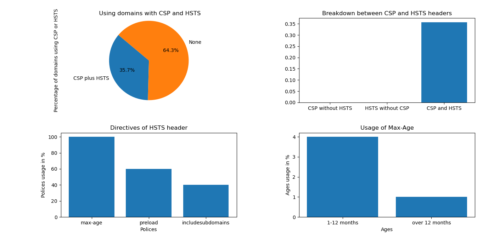

# Measuring HSTS Adoption

<a>
    
</a>

### Authors
- Mattia Dei Rossi - 885768@stud.unive.it
- Alessandro Simonato - 882339@stud.unive.it 

## How to run 
- Install requirements
```bash
pip install -r requirements.txt
```
- Run `crawler.py` to get informations of sites.
```bash
python3 crawler.py -f tranco.csv -o headers_data.json -n 20 # Get informations of the top 20 domains
```
- Run `analizer.py` to obtain results for the measurements of HSTS adoption
```bash
python3 analizer.py -f headers_data.json
```
- Results


## Documentation
Please read the [Report](./doc/Report.md) to see how HSTS works and a case study.