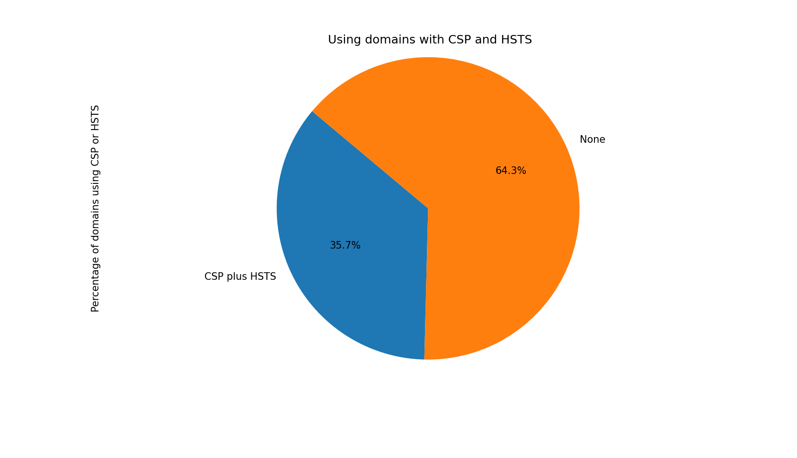
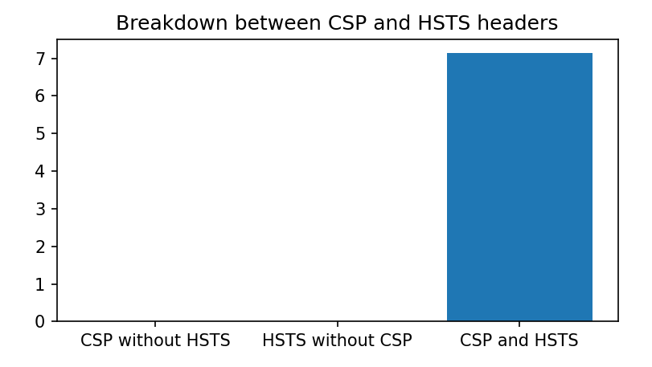
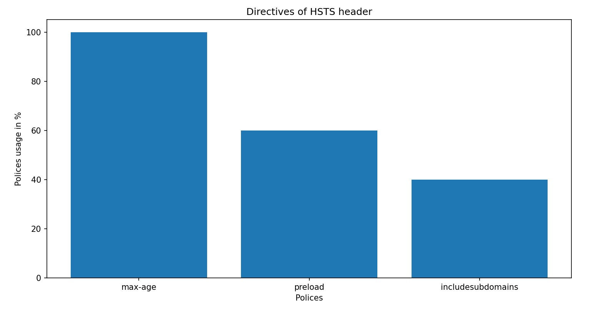

# Measuring HSTS Adoption

### Authors
- Mattia Dei Rossi - 885768@stud.unive.it
- Alessandro Simonato - 882339@stud.unive.it 

## Goals
We are tasked to measure the state of HSTS adoption on the Web. This activity is performed in groups of two people and involves several steps:
1.  Write a crawler to collect HSTS policies from live websites and store them, e.g., in a database
2. Write a security analyzer for the collected HSTS policies designed to draw conclusions about the state of security in the wild
3. Write a report detailing the crawling procedure, the security analysis procedure and the findings of your study

## HSTS
HTTP Strict Transport Security (HSTS) is a policy mechanism that helps to protect websites against man-in-the-middle attacks such as cookie hijacking. The HSTS Policy is communicated by the server to the user agent via an HTTP response header field named `Strict-Transport-Security`. HSTS can be used also to prevent SSL stripping.
The HSTS policies are:

### max-age
It specifies the maximum amount of time (in seconds) that the HSTS policy should be enforced by the browser.

### includeSubDomains
It instructs the browser to apply the HSTS policy not only to the current domain but also to all of its subdomains. Using subdomains in the HSTS policy ensure that all communication with the entire domain hierarchy is encrypted over HTTPS,

### preload
It indicates to web browsers that the domain should be included in the HSTS preload list.
The HSTS preload list is a list of websites maintained by browser vendors that are hardcoded into their respective browsers. Websites on this list will automatically have the HSTS policy enforced, even for the initial HTTP connection attempt. This means that before the browser even attempts to make a connection to a website on the preload list, it will ensure that the connection is over HTTPS.

## CSP vs HSTS 
CSP (Content Security Policy) and HSTS (HTTP Strict Transport Security) are both important security mechanisms used to enhance web application security, but they serve different purposes:

### Content Security Policy (CSP):
- CSP is a security standard that helps prevent various types of attacks, such as Cross-Site Scripting (XSS) and data injection attacks.
- It allows web developers to control which resources (scripts, stylesheets, fonts, etc.) a browser is allowed to load and execute on a particular web page. 
- CSP works by allowing developers to define a whitelist of trusted sources for content such as scripts, stylesheets, and other resources. If a browser detects that content from an unauthorized source is attempting to load or execute, it will block it according to the policy rules.
- CSP headers are delivered via HTTP headers or within a meta tag in the HTML code.
### HTTP Strict Transport Security (HSTS):
- HSTS is a security policy mechanism that helps protect websites against man-in-the-middle attacks and cookie hijacking by forcing web browsers to communicate with a website using only secure HTTPS connections.
- Once a web server sends an HSTS header to a browser, the browser will only communicate with that server over HTTPS for a specified period of time (the max-age directive).
- This helps to ensure that sensitive data such as login credentials or session cookies are always transmitted over encrypted connections, reducing the risk of interception or tampering by attackers.
- HSTS headers are delivered via HTTP response headers.

In summary, CSP is primarily focused on preventing malicious code execution and data injection attacks by controlling which resources can be loaded and executed on a web page, while HSTS is focused on enforcing secure communication between the browser and the server by mandating the use of HTTPS.

## Case study
We analyzed the first 100 record of `tranco.csv` and we obtained the following results:
The pie chart shows the percentage of domains using Content Security Policy (CSP) and HTTP Strict Transport Security (HSTS).
-None: 64.3% of domains use neither CSP nor HSTS.
-CSP and HSTS: 35.7% of domains use both CSP and HSTS.

 The majority of domains (64.3%) do not yet use either CSP or HSTS. This means that these websites are vulnerable to a range of cyber threats, including:

**Script injection**: Attackers can inject malicious code into websites that do not use CSP, allowing them to steal data, hijack users or even take control of the website.

**Cross-Site Scripting (XSS)**: XSS is a type of attack that allows attackers to inject malicious JavaScript code into websites. This code can be used to steal cookies, user sessions or even take control of the user's browser.

**Mixed Content Sniffing**: When a website does not use HSTS, the connections between the website and the user's browser are not encrypted. This means attackers can intercept connections and steal sensitive data, such as passwords or credit card information.

Instead, with this graph we can see of those using CSP or HSTS how they are apportioned (i.e., whether they use only one or both)

In this graph we can see that no domain only CSP or HSTS. But they all use both CSP and HSTS. This is the safest group of websites, as they are protected from a number of cyber threats.

The bars in the graph show the policies we found and with what percentage they are repeated.

We can note The most common HSTS directives are max-age and preload.
The includesubdomains directive is used less frequently.

